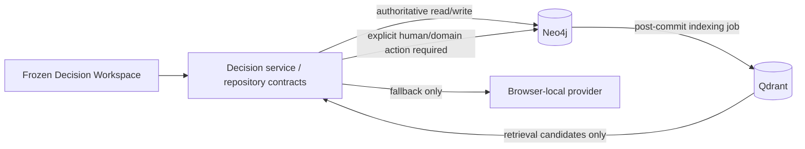

# Consequential Decision Increment 1C — Persistence Specification v0.1

**Status:** Proposed; database implementation is not authorized by this document.  
**Scope:** Local persistence architecture for the frozen Increment 1B Consequential Decision Record (CDR).  
**Non-goals:** No Neo4j/Qdrant access, schema/collection creation, drivers, cloud/Vercel changes, UI redesign, authentication, or migration of unrelated ROI-EA/FEOA/ERIR state.

## 1. Frozen baseline and governing rule

Increment 1B v0.1 is accepted and frozen. Its domain normalizers, decision-state rules, least-regret-next-move rule, and Decision Workspace rendering contract are the compatibility boundary. In particular, persistence must preserve:

- nondominated and comparison-undetermined alternatives without forced ranking;
- distinct `COLLABORATIVE_JUDGMENT` and `RESERVED_HUMAN_JUDGMENT` states;
- authority provenance and unresolved/disputed/expired authority conditions;
- independent scale/stability dimensions, not a composite score;
- uncertainty, history, and the persistent next move.

> Persistence may change where state lives, but it must not change what the decision means.

Neo4j is the authoritative structured store when the Neo4j provider is selected. Qdrant is retrieval-only. A Qdrant result is never accepted evidence, authority, a relationship, a recommendation, or a state change until an explicit domain-level evidence/decision action creates an authoritative Neo4j record.

## 2. Existing implementation facts

The current CDR contract is in `consequential-decision-model.mjs`; `normalizeDecision` owns the current shape: decision fields plus authority records, alternatives, constraints, gates, evidence, judgment assessments, delegation records, scale/stability assessments, next moves, and revisions. `decisionState`, `criticalConditions`, `recommendNextMove`, `validateJudgmentAssessment`, and `validateDelegation` are frozen semantic checks.

`consequential-decision-workspace.mjs` owns the renderer and the three acceptance fixtures: community-bank ESA, public-sector FPA, and agentic workflow. `app.js` persists the existing broader ROI-EA browser data in `localStorage` key `roi-driven-enterprise-architect-mvp-v1`.

Two important boundaries follow:

1. The current CDR fixtures are rendered directly; they are not yet a `data.consequentialDecision` browser-local record. 1C must add a provider seam without changing renderer inputs, but must not claim a browser-local CDR migration already exists.
2. Constraints, gates, and scale/stability assessments already contain evidence ID arrays. Alternatives do not have a typed evidence-link field, and the model has no universal `EvidenceLink` entity. Therefore 1C must only persist links representable by the current model. A general `SUPPORTS`/`CHALLENGES` link model is a proposed, separately approved domain extension—not an inferred 1C storage shortcut.

## 3. Repository and service contracts

All contracts accept/return normalized domain objects or plain IDs. They expose no Cypher, driver session, Qdrant point, vector, or database error type to the UI.

| Contract | Responsibility and core operations | Authority / atomicity / outage behavior |
|---|---|---|
| `DecisionRepository` | `getDecision(id)`, `listDecisions(filters)`, `saveDecision(decision, expectedVersion)`, `retireDecision(id, expectedVersion)` | Authoritative. Saving the root and its owned aggregate is one Neo4j transaction. Unavailable/read/write failure returns a typed `PersistenceUnavailable`/`PersistenceConflict`; no silent local merge. |
| `AlternativeRepository` | `listByDecision`, `save`, `retire` | Authoritative; normally called through the decision aggregate transaction. Returns normalized alternative. |
| `AuthorityRepository` | `listByDecision`, `save`, `retire` | Authoritative. Any save that leaves a linked delegation invalid fails domain validation before commit. |
| `ConstraintGateRepository` | `listConstraints`, `listGates`, `saveConstraint`, `saveGate`, `retire` | Authoritative. Constraint/gate and supplied evidence references are atomic when changed together. |
| `EvidenceRepository` | `get`, `listByDecision`, `saveEvidence`, `linkExistingEvidence`, `retireEvidence` | Authoritative metadata and explicit current-model links only. A retrieval candidate is not an input to `saveEvidence` without an explicit caller action. |
| `JudgmentRepository` | `listByDecision`, `saveAssessment`, `retire` | Authoritative. Preserves judgment and target enums verbatim after normalization. |
| `DelegationRepository` | `listByDecision`, `saveDelegation`, `retire` | Authoritative. Calls frozen `validateDelegation` against authoritative authority records; it never expands authority. |
| `ScaleStabilityRepository` | `listByDecision`, `saveAssessment`, `retire` | Authoritative. One assessment per its existing ID; dimensions remain separate properties. |
| `RevisionRepository` | `appendRevision`, `listRevisions` | Authoritative and append-only. No update/delete operation in 1C. |
| `NextMoveRepository` | `listByDecision`, `saveNextMove`, `retire` | Authoritative. Does not replace the derived recommendation rule; persisted moves are explicit records. |
| `VectorRetrievalRepository` | `enqueueEvidenceIndex`, `searchEvidence(query, filters)`, `markIndexResult` | Retrieval-only. Search returns candidate references/provenance, never domain mutations. Index failures are visible retryable conditions, not authoritative rollback triggers. |

Service methods should return `{ok:true,value}` or `{ok:false,error:{code,message,retryable}}`. Required codes: `NOT_FOUND`, `VALIDATION_FAILED`, `CONFLICT`, `PERSISTENCE_UNAVAILABLE`, `MALFORMED_RECORD`, and `RETRIEVAL_UNAVAILABLE`. Domain validation errors remain distinct from transport failures.

## 4. Neo4j logical mapping (proposed)

All nodes have `id`, `createdAt`, `updatedAt`, `version`, and `retiredAt` (null when active), except append-only revisions which use `recordedAt` and no mutable lifecycle. IDs are the current normalized IDs and are globally unique within their label. Create uniqueness constraints only in the implementation increment, not now.

| Node label | Source and authoritative scalar properties | Relationships (direction, cardinality) |
|---|---|---|
| `ConsequentialDecision` | CDR `id`, title, governingQuestion, purpose, status, targetStatus, judgmentMode, decisionOwnerId | `(:ConsequentialDecision)-[:HAS_ALTERNATIVE]->(:Alternative)` 0..n; similarly `HAS_AUTHORITY`, `HAS_CONSTRAINT`, `HAS_GATE`, `HAS_EVIDENCE`, `HAS_JUDGMENT`, `HAS_DELEGATION`, `HAS_SCALE_STABILITY`, `HAS_NEXT_MOVE`, `HAS_REVISION`. |
| `Alternative` | title, description, structuralDirection, comparisonStatus, reversibility, transitionBurden, evidenceStrength | Exactly one parent decision in 1C. `[:HAS_SCALE_STABILITY]` assessment is 0..n (current model does not impose uniqueness by alternative). Dependency-effect strings remain a property array. |
| `AuthorityRecord` | authorityType, holder, source, scope, effective/expiry dates, status, constraints array | Exactly one parent decision. `(:DelegationRecord)-[:SOURCED_FROM]->(:AuthorityRecord)` is 0..1 from current `delegationAuthorityRef`. |
| `Constraint` | name, description, type, severity, status, affectedCapabilityIds array | Exactly one parent. `(:Constraint)-[:EVIDENCED_BY]->(:EvidenceItem)` 0..n from existing `evidenceIds`. |
| `Gate` | name, governingQuestion, criticality, status | Exactly one parent. `(:Gate)-[:EVIDENCED_BY]->(:EvidenceItem)` 0..n from existing `evidenceIds`. |
| `EvidenceItem` | title, sourceRef, sourceType, claimType, proposition, confidence, date, reviewer, supersededBy | Exactly one parent in the current CDR model. Existing supersession is `(:EvidenceItem)-[:SUPERSEDED_BY]->(:EvidenceItem)` 0..1 when ID resolves; otherwise retain raw property and report malformed linkage. |
| `JudgmentAssessment` | decisionOrSubdecisionId, judgmentMode, targetStatus, humanDecisionRight, rationale; contribution/prohibition/trigger arrays | Exactly one parent decision. `decisionOrSubdecisionId` remains a property because no subdecision node exists today. |
| `DelegationRecord` | mission, accountableOwner, authorityEnvelope, reversibility, interventionOwner, authorizationStatus; action/condition arrays | Exactly one parent; optional `SOURCED_FROM` authority relationship. |
| `ScaleStabilityAssessment` | all ten independently named support-status dimensions, assessmentStatus | Exactly one parent; `(:ScaleStabilityAssessment)-[:ASSESSMENT_OF]->(:Alternative)` 0..1 from `alternativeId`. Gate/evidence arrays become `REQUIRES_GATE`/`EVIDENCED_BY` relationships when IDs resolve. |
| `DecisionRevision` | current existing revision fields are fixture-defined (`label`, `detail`); add only system metadata above | Exactly one parent. Append order is `recordedAt`, then immutable `id`; no inferred semantic order. |
| `NextMove` | type, description, rationale, reversibility, informationGain, owner, status | Exactly one parent. |

**Properties rather than nodes:** string arrays such as permitted/prohibited actions, affected parties, dependency effects, triggers, scope constraints, capability IDs, and AI contribution remain properties because the frozen model has no independently managed objects for them. Do not manufacture Party, Capability, Source, or Subdecision graph entities in 1C.

**Retirement and history:** ordinary records are soft-retired with `retiredAt`; they are excluded by default but remain available for history. A CDR retirement retires the root only; child record retirement is explicit. Revisions are append-only. No hard deletion in the first implementation slice.

## 5. Qdrant retrieval-only design (proposed)

One collection: `consequential_evidence_v1`. The embedding model is deliberately **deferred**; none is established in the repository.

Each point represents one retrieval chunk from one authoritative `EvidenceItem`, not a decision, authority, judgment, scale assessment, or next move. Chunk at a stable source/proposition boundary; do not split a short evidence item. Long source text, if later introduced, is chunked deterministically by source section with a stable ordinal.

| Payload field | Purpose |
|---|---|
| `externalId` | Stable point ID: `<evidence-id>:<source-version>:<chunk-ordinal>`. |
| `neo4jEvidenceId`, `decisionId` | Locate authoritative metadata and decision scope. |
| `sourceRef`, `sourceType`, `claimType`, `confidence`, `reviewer` | Retrieval interpretation and filters. |
| `sourceVersion`, `supersededBy`, `retiredAt`, `indexedAt`, `indexStatus` | Version/supersession and operational state. |
| `textHash`, `chunkOrdinal` | Detect stale/repeated index work. |

Required filters: `decisionId`, `claimType`, `sourceType`, `retiredAt is null`, and optionally evidence ID/version. The payload must not duplicate complete authoritative decision state. On retirement/supersession, mark/remove the point asynchronously; searches must filter retired/superseded material. Qdrant unavailability only makes retrieval unavailable.

## 6. Serialization and hydration contract

1. Normalize with the existing normalizers before serialize and after hydrate. IDs are preserved exactly; no storage-generated replacement IDs.
2. Enums are stored as their existing uppercase values. Unknown enum values are a malformed authoritative record, not silently coerced to a new meaning; hydration may normalize only according to the frozen model while recording the validation fault.
3. Existing date-only values remain ISO date strings; timestamps added by storage are ISO-8601 UTC. Do not reinterpret date-only values as timestamps.
4. Arrays preserve order where the domain presents ordered lists (revisions, next moves, string arrays); graph relationships therefore carry an `ordinal` property when reconstructing an ordered list. Set-like ID arrays are normalized/deduplicated as today.
5. Missing optional values hydrate to the same empty string/empty array defaults used by current normalizers. `null` is not serialized for optional model fields; absence is canonical. `retiredAt` and storage metadata may be null.
6. Version is optimistic-concurrency metadata, not domain revision history. `saveDecision` requires an expected version after first persistence.
7. Browser-local objects and Neo4j aggregates hydrate to the same `normalizeDecision` result. The renderer accepts only that normalized domain object; it never branches on provider.
8. Derived decision state and recommended next move are recomputed from hydrated data using frozen functions. Persisted explicit `nextMoves` stay records; no provider can force a recommendation.

## 7. Browser-local fallback and migration boundaries

### Provider selection

- **Browser-local-only mode:** browser-local CDR record is authoritative for that mode; clearly label it `LOCAL_ONLY`.
- **Neo4j-connected mode:** Neo4j is authoritative. Browser-local may cache a read-only last-known copy with source ID/version, but may not accept writes while disconnected.
- **Neo4j unavailable:** show a visible unavailable state; permit only explicit switch to `LOCAL_ONLY` for a separate local record. Never silently copy/merge the last cache into Neo4j later.
- **Neo4j available, Qdrant unavailable:** structured reads/writes proceed; retrieval is visibly unavailable and indexing work is queued/retryable.
- **Read failure / stale cache:** display source, version, and stale status; do not present it as current authoritative state.
- **Write failure / conflict:** no local optimistic overwrite. Retain unsaved draft separately, require reload/compare/explicit resolution, and use version conflict failure.
- **Reconnect:** re-read authoritative Neo4j record first. Do not auto-merge divergent local drafts.

### Migration

1C does not auto-migrate existing general ROI-EA/FEOA browser state. The CDR fixture data is not yet persisted in `app.js`, so there is no existing CDR production record to migrate automatically.

The first migration mechanism is explicit, import-based, and reversible: export normalized CDR JSON with `contractVersion`, `sourceProvider`, source ID, source version/hash, and exported timestamp; validate and preview; import only on confirmation; preserve IDs; reject duplicate IDs unless the caller explicitly selects an allowed versioned update. Keep the source JSON unchanged. Rollback is a compensating retirement/import reversal, not a destructive delete.

## 8. Transaction and consistency model

Use one Neo4j transaction for a decision aggregate write: root upsert, changed child nodes, authoritative relationships, revision append, and next-move update. Required atomic operations include decision + alternatives; authority + linked delegation; evidence + representable evidence links; scale assessment + target links; and decision-state-affecting update + revision/next-move record.

Validate normalized domain rules before opening the transaction and revalidate relevant linkage inside it. Missing targets, duplicate IDs, invalid delegation source authority, and stale versions fail the transaction.

After a successful commit, enqueue evidence indexing with an outbox-like `IndexingRequest` record or equivalent durable retry marker in Neo4j. Qdrant failure marks that request failed/retryable and does **not** roll back valid authoritative state. Indexing consumes only committed evidence versions.

## 9. Acceptance and regression plan

For every fixture: construct frozen object; normalize; serialize; persist through a contract-test provider; hydrate; normalize; compare semantic state; render through unchanged `renderDecisionWorkspace`; assert no semantic drift.

| Fixture | Required parity assertions |
|---|---|
| Community-bank ESA | Two nondominated alternatives remain; `decisionState` is comparison-undetermined; no forced recommendation; all scale/stability dimensions remain separate; unsupported stability remains visible; next move unchanged. |
| Public-sector FPA | Institutional, funding, and disputed implementation authority remain distinct; land-access dependency/constraint visible; provenance fields reconstruct; authority break remains a critical condition. |
| Agentic workflow | Collaborative and reserved-human assessments remain distinct; human decision right and AI contribution remain separate; delegation still validates only against its source authority; persistence cannot widen permitted actions. |

Negative tests: unavailable Neo4j; unavailable Qdrant; malformed graph payload; unknown enum; duplicate ID; missing relationship target; stale expected version; failed vector indexing; unauthorized delegation; authority-chain break; missing evidence target; partial aggregate write. Contract tests run before drivers are introduced using an in-memory provider that obeys the interfaces.

The following remain unchanged and passing: `consequential-decision-model.test.mjs`, `consequential-decision-workspace.test.mjs`, `authority-envelope.test.mjs`, `authority-acceptance-q1-q8.test.mjs`, `feoa-foundation.test.mjs`, `feoa-acceptance.test.mjs`, `feoa-ui-wiring.test.mjs`, `public-demo-config.test.mjs`, `erir-proxy.test.mjs`, plus the complete existing Node regression suite. Persistence adapters adapt to these contracts; tests are not weakened to fit storage.

## 10. Safe implementation sequence

1. **1C-A:** Add provider/repository contract definitions and in-memory contract tests only.
2. **1C-B:** Add Neo4j adapter, schema migration tooling, and the three fixture parity tests; no UI contract change.
3. **1C-C:** Add explicit browser-local CDR provider and fallback/cache behavior with parity/conflict tests.
4. **1C-D:** Add Qdrant evidence indexing/retrieval adapter, outbox/retry behavior, and retrieval-only tests.
5. **1C-E:** Combined outage, stale-cache, conflict, and indexing-failure tests.
6. **1C-F:** Local functional/visual acceptance on the same three fixtures; confirm 1B renderer remains unchanged.

## 11. Unresolved decisions and go/no-go gate

Open decisions requiring approval before implementation:

1. Whether to introduce a typed evidence-link domain object to support `SUPPORTS`/`CHALLENGES` for alternatives and authorities. This is **not** covered by the current frozen model.
2. The browser-local CDR key/version and whether local-only mode supports multiple CDRs. Existing `app.js` stores broader ROI-EA data but not a CDR aggregate.
3. Exact Neo4j and Qdrant local deployment/configuration ownership, plus embedding-model selection.
4. Whether each CDR owns evidence items exclusively in 1C or evidence may later be shared across decisions. The current model supports the former most directly.

**Go/no-go:** `SPECIFICATION_REVISION_REQUIRED` until those four decisions are approved. Once resolved, implementation may begin only when 1C-A contract tests demonstrate normalized round-trip parity and all frozen tests remain green. No database implementation is authorized by this specification alone.
